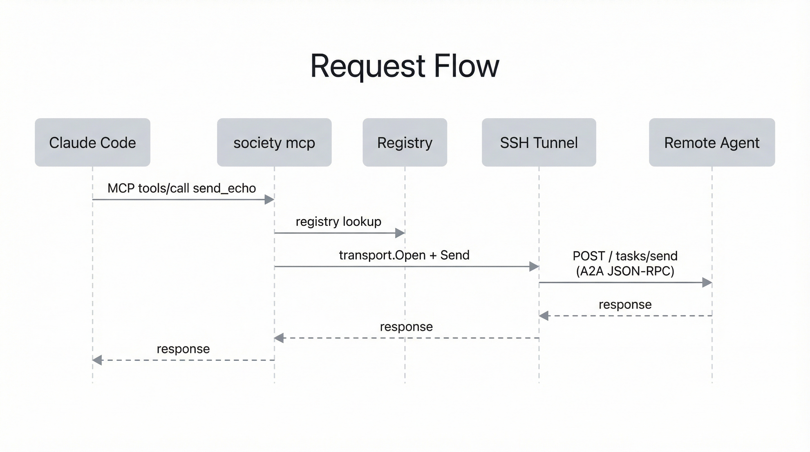

Society is a CLI tool for running and connecting AI agents across machines. It implements the [Agent-to-Agent (A2A) protocol](https://google.github.io/A2A/) over JSON-RPC 2.0, letting agents communicate regardless of where they run — locally, in Docker containers, or on remote servers over SSH.

## What it does

- **Runs agents** from YAML config files as HTTP servers
- **Routes messages** between agents through HTTP, SSH tunnels, Docker networks, or stdio pipes
- **Manages a registry** of known agents with their connection details
- **Exposes agents as MCP tools** for Claude Desktop, Cursor, or any MCP-compatible client
- **Daemon mode** starts multiple agents in one process

## How agents work

Every agent is a JSON-RPC 2.0 server that handles one method: `tasks/send`. You send a message, you get a response. That's it.

Agents are defined by two things:

1. **A handler** that processes messages (echo, greeter, or exec — which wraps any CLI tool)
2. **A transport** that determines how to reach the agent (HTTP, SSH, Docker, or stdio)

The `exec` handler is the most powerful — it lets you wrap any command-line tool as an agent. The default config wraps Claude Code, turning it into a conversational agent that maintains session state across messages.

## Architecture

### Request flow

Here's what happens when Claude Code sends a message to a remote agent:

## Trust model

Society is built on trust. There is no authentication, no approval gates, and no permission system — agents accept and process any incoming message. This is by design.

The assumption is that you own and control every machine in your network. You set up each one yourself, install the agents, and decide what they can do. Your private network (typically [Tailscale](https://tailscale.com) or a LAN) is the security boundary — only machines you've added can reach your agents.

This means Society is not designed for untrusted environments. Don't expose agent ports to the public internet without additional protections. If you need stricter controls in the future (API keys, allowlists, per-agent permissions), those can be layered on — but for a personal network of machines you own, trust is the right default.

## Next steps

- [Install society](/getting-started/installation/) to get the binary
- Follow the [quickstart](/getting-started/quickstart/) to run your first agents and send messages across machines
